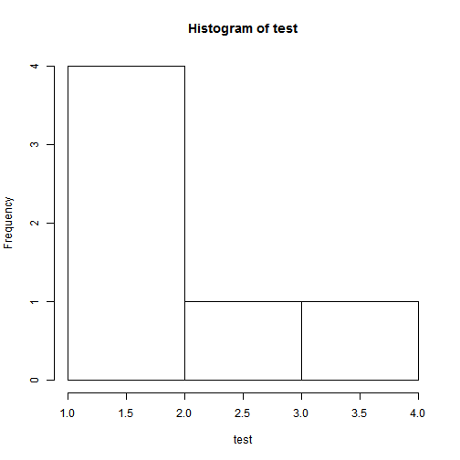

Titanic : Predicting Survivors
========================================================
author: Courtney / Katie/ Jamie / Sayooj
date: 

Goal
========================================================

Predict survivors from the Titanic tragedy

- Binary Classification problem : Survived or NOT
- Reasonably clean dataset
- Can we predict 100% ? 

Slide With Code
========================================================


```r
summary(cars)
```

```
     speed           dist       
 Min.   : 4.0   Min.   :  2.00  
 1st Qu.:12.0   1st Qu.: 26.00  
 Median :15.0   Median : 36.00  
 Mean   :15.4   Mean   : 42.98  
 3rd Qu.:19.0   3rd Qu.: 56.00  
 Max.   :25.0   Max.   :120.00  
```

EDA
========================================================

 
